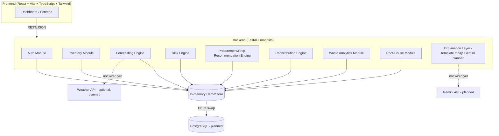
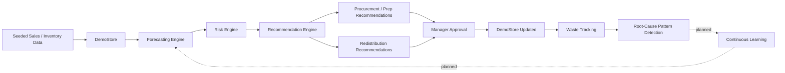
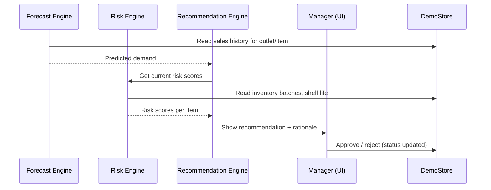
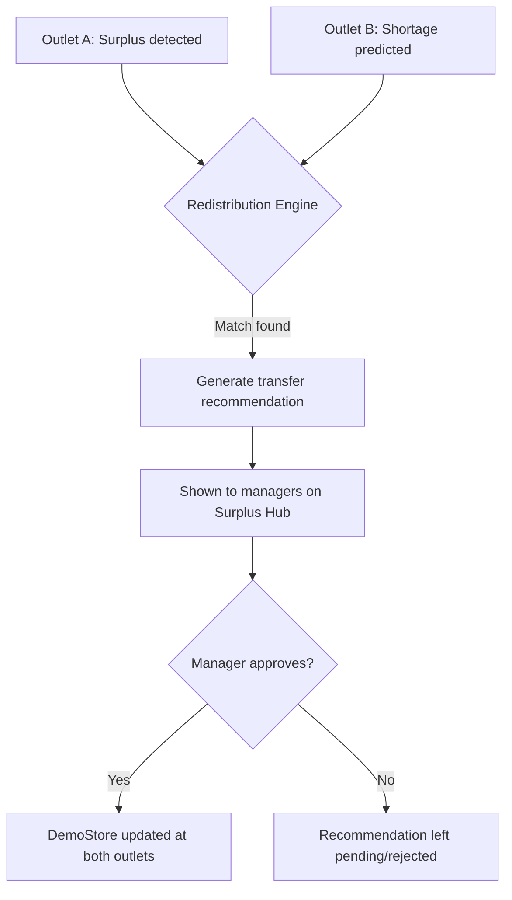

# System Architecture

## High-Level Architecture
FoodWise AI is built as a **modular FastAPI monolith** — one deployable backend service with clearly separated internal modules (domains). We deliberately avoided microservices; for a student-built prototype, a monolith with clean module boundaries is faster to build, easier to debug, and just as demoable.

The diagram below reflects what's actually running today. The database, Gemini API, and Weather API shown are the planned integration points — none of them exist yet. Where the code differs from the original plan, it's called out.

## Frontend — As Built
- **React + Vite + TypeScript + Tailwind CSS** (originally planned as Next.js — the team ended up building it in Vite via Figma Make, and that's what shipped)
- Screens actually built: Command Center (dashboard), Forecast & Prep, Waste Log (mobile-first), Waste Explorer, Surplus Hub (redistribution), Impact
- There's no separate login screen — the frontend authenticates automatically with seeded demo credentials on load; there's also no standalone Inventory, Risk, or Root-Cause page — risk and root-cause data feed into the Command Center and Forecast & Prep views instead of getting their own screens
- Charts via **Recharts**
- Talks to backend only via REST API — no direct data-store access from the frontend
- See `docs/INTEGRATION_STATUS.md` in the repo root for exactly which charts use live backend data vs. still-mocked arrays

## Backend — As Built
- **FastAPI (Python)**, organized as internal routers rather than separate services:
  - `auth` — login, signed bearer-token issuance, RBAC
  - `inventory` — ingredients, batches, stock levels, FEFO ordering
  - `forecast` — demand prediction per item/outlet
  - `risk` — spoilage risk scoring
  - `recommendations` — procurement, preparation, redistribution, root-cause, and the unified recommendation feed all live in this router group
  - `waste` — waste event logging and analytics
  - `alerts` — risk-based alerts, dismissible per alert
  - `catalog` — outlets and ingredients lookup

## Storage — As Built vs. Planned
- **As built**: a single in-process `DemoStore` object (`backend/app/data/seed_data.py`) holding plain Python dataclasses, seeded with demo data on startup. No database, no persistence across restarts.
- **Planned**: PostgreSQL with a SQLAlchemy ORM layer. The domain model names in `backend/app/domain/models.py` were deliberately kept aligned with the planned schema in `05_DATABASE_DESIGN.md` so that swapping in a real database later shouldn't require rewriting the service/business logic — just the storage layer underneath it.

## AI Layer — As Built vs. Planned
- **Forecasting engine (built)**: practical statistical approach (day-of-week weighting + trend factor + weekend bump on historical sales) — not a trained model
- **Risk engine (built)**: weighted rule-based scoring using shelf life remaining, quantity vs. predicted consumption, and ingredient perishability
- **Recommendation engine (built)**: rule-based logic for procurement, preparation, and redistribution matching
- **Explanation layer (partially built)**: a deterministic template function turns structured backend facts into a sentence today. The plan is to swap this for a real Gemini API call that's only allowed to phrase numbers the backend already computed — but that call isn't wired in yet

## External APIs
- **Gemini API** — planned, for natural-language explanations ("why is this recommended"). Not called anywhere in the current backend.
- **Weather API** — optional, planned, as an extra demand-forecasting signal.

## Authentication
- Signed bearer token issued on login (HMAC-SHA256, JWT-*like* format but not a standard JWT library)
- Role-based access control: `admin`, `manager`, `staff`
- Disruptive actions (approving procurement, approving redistribution) require a role with approval permission — enforced at the API layer via FastAPI dependencies, not just in the UI
- Demo passwords are plaintext-compared against seeded values — real password hashing is future work (see `03_TRD.md`)

## Data Flow

## Recommendation Workflow

## Multi-Outlet Redistribution Workflow

## Notes on Realism for a Student Prototype
- Single backend process, single in-memory store — no message queues or container orchestration required for the demo
- Background jobs (forecast/risk recompute) currently run synchronously per request rather than as scheduled tasks — fine at demo scale, a real task queue (Celery/RQ) would be needed at production scale
- All diagrams above reflect what's actually running today, with planned-but-unbuilt pieces marked as such rather than presented as finished
