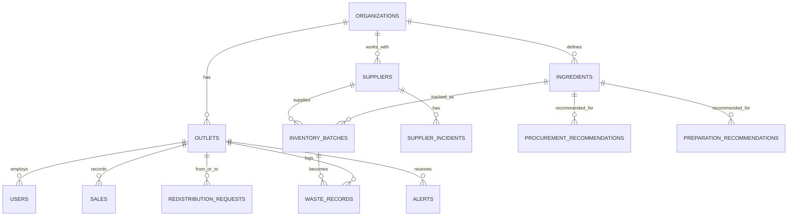

# Database Design

## Current State vs. This Document
There is **no database in the current prototype.** The backend holds its state in a single in-process `DemoStore` object (`backend/app/data/seed_data.py`) — plain Python dataclasses defined in `backend/app/domain/models.py`, seeded on startup, reset on every restart.

The schema below is the **planned production schema**: PostgreSQL, accessed via SQLAlchemy (async, with `asyncpg`). It's written as a real target, not aspirational filler — the current in-memory dataclasses were deliberately named to match these entities, so moving to this schema later should mostly be a storage-layer swap rather than a rewrite of the forecasting/risk/recommendation logic. Each entity below notes whether the equivalent already exists in the current `DemoStore` dataclasses or is planned-only.

Design principle: keep the schema lean, but include `organization_id`/`outlet_id` foreign keys from day one so the schema doesn't need a rewrite when the product moves to multi-tenant later.

## Entities

### users — *exists today (as `User` dataclass, in-memory)*
| Field | Type | Notes |
|---|---|---|
| id | UUID (PK) | |
| organization_id | UUID (FK → organizations.id) | |
| name | varchar | |
| email | varchar, unique | |
| password_hash | varchar | **Planned.** Current `User` dataclass stores a plaintext demo password field instead — see `03_TRD.md` security notes. |
| role | enum(admin, manager, staff) | matches current `Role` literal type |
| outlet_id | UUID (FK → outlets.id, nullable) | null for org-level (chain) roles |
| created_at | timestamp | not tracked on the current dataclass |

### organizations — *exists today (as `Organization` dataclass, in-memory)*
| Field | Type | Notes |
|---|---|---|
| id | UUID (PK) | |
| name | varchar | |
| created_at | timestamp | not tracked on the current dataclass |

### outlets — *exists today (as `Outlet` dataclass, in-memory)*
| Field | Type | Notes |
|---|---|---|
| id | UUID (PK) | |
| organization_id | UUID (FK) | |
| name | varchar | |
| city | varchar | |
| address | varchar | |
| created_at | timestamp | not tracked on the current dataclass |

### ingredients — *exists today (as `Ingredient` dataclass, in-memory)*
| Field | Type | Notes |
|---|---|---|
| id | UUID (PK) | |
| organization_id | UUID (FK) | |
| name | varchar | |
| category | varchar | e.g. produce, dairy, grain |
| unit | varchar | kg, g, l, unit |
| default_shelf_life_days | int | |
| cost_per_unit | numeric | |
| perishability | numeric | already on the current dataclass (0–1 factor used directly in risk scoring) — not in the original doc, added here to match the real model |

### inventory — *not a separate table today*
The current prototype tracks inventory purely at the batch level (`InventoryBatch`, below) — there's no separate denormalized `inventory` rollup row per ingredient/outlet. If a fast "current total on hand" lookup is needed later, this table is worth adding then; it isn't load-bearing for anything currently built.
| Field | Type | Notes |
|---|---|---|
| id | UUID (PK) | |
| outlet_id | UUID (FK) | |
| ingredient_id | UUID (FK) | |
| current_quantity | numeric | denormalized total across batches, kept in sync |
| unit | varchar | |
| updated_at | timestamp | |

### inventory_batches — *exists today (as `InventoryBatch` dataclass, in-memory)*
| Field | Type | Notes |
|---|---|---|
| id | UUID (PK) | |
| outlet_id | UUID (FK) | on the dataclass directly (planned schema nests it under `inventory_id` instead — worth reconciling before building the real table) |
| ingredient_id | UUID (FK) | |
| batch_code | varchar | |
| quantity | numeric | |
| unit | varchar | present on the dataclass, not in the original planned table |
| purchase_date | date | |
| expiry_date | date | indexed conceptually today — batches are sorted by this field for FEFO ordering |
| supplier_id | UUID (FK → suppliers.id) | |
| storage_condition | varchar, default `"normal"` | used in risk scoring as a small pressure bump when not `"normal"` |

### suppliers — *exists today (as `Supplier` dataclass, in-memory)*
| Field | Type | Notes |
|---|---|---|
| id | UUID (PK) | |
| organization_id | UUID (FK) | |
| name | varchar | |
| contact_info | varchar | |

### supplier_incidents — *planned only, not built*
No supplier-incident tracking exists in the current code at all — no dataclass, no endpoint, no seed data. This table (and the supplier/batch pattern detection feature it supports) is future scope.
| Field | Type | Notes |
|---|---|---|
| id | UUID (PK) | |
| supplier_id | UUID (FK) | |
| batch_id | UUID (FK → inventory_batches.id, nullable) | |
| outlet_id | UUID (FK) | |
| incident_type | varchar | e.g. quality, spoilage, delay |
| description | text | |
| reported_at | timestamp | |

### sales — *exists today (as `Sale` dataclass, in-memory)*
| Field | Type | Notes |
|---|---|---|
| id | UUID (PK) | |
| outlet_id | UUID (FK) | |
| ingredient_id | UUID (FK) | current dataclass sells at ingredient level, not menu-item level — see `menu_items` note below |
| quantity_sold | numeric | |
| sale_date | date | |
| channel | varchar, default `"dine-in"` | |

### demand_forecasts — *not persisted today*
Forecasts are computed on the fly per request (`forecast_for_item`) and returned directly — nothing is written back to storage. This table describes what persisting forecast history would look like, useful once accuracy tracking (continuous learning) gets built.
| Field | Type | Notes |
|---|---|---|
| id | UUID (PK) | |
| outlet_id | UUID (FK) | |
| ingredient_id | UUID (FK) | |
| forecast_date | date | |
| predicted_quantity | numeric | |
| lower_bound | numeric | |
| upper_bound | numeric | |
| model_version | varchar | the current `ForecastResult` dataclass already carries a `model_version` string (`"moving-average-dow-v1"`), so this maps cleanly when persistence is added |
| created_at | timestamp | |

### spoilage_risks — *not persisted today*
Same story as forecasts — `score_batch_risk` computes a `RiskResult` on demand and returns it; nothing is stored.
| Field | Type | Notes |
|---|---|---|
| id | UUID (PK) | |
| inventory_batch_id | UUID (FK) | |
| risk_level | enum(low, medium, high) | |
| risk_score | numeric | 0–1, matches current scoring output |
| computed_at | timestamp | |
| rationale | text | matches the current `rationale` string field |

### waste_records — *exists today (as `WasteRecord` dataclass, in-memory)*
| Field | Type | Notes |
|---|---|---|
| id | UUID (PK) | |
| outlet_id | UUID (FK) | |
| ingredient_id | UUID (FK) | |
| inventory_batch_id | UUID (FK, nullable) | |
| quantity | numeric | |
| reason | varchar | overproduction, spoilage, quality issue, etc. |
| stage | varchar | prep, storage, service |
| logged_by | UUID (FK → users.id) | |
| logged_at | timestamp | |

### redistribution_requests — *exists today, tracked via status map rather than a full table*
The current `DemoStore` computes redistribution opportunities live from inventory + forecast, and separately tracks approval status per opportunity ID in a dict (`redistribution_statuses`). There's no full row with `created_at`/`resolved_at` history — approving one just flips its status.
| Field | Type | Notes |
|---|---|---|
| id | UUID (PK) | |
| ingredient_id | UUID (FK) | |
| from_outlet_id | UUID (FK → outlets.id) | |
| to_outlet_id | UUID (FK → outlets.id) | |
| suggested_quantity | numeric | |
| status | enum(pending, approved, rejected, completed) | current code only ever sets `pending`/`approved` |
| rationale | text | |
| created_at | timestamp | not tracked today |
| resolved_at | timestamp (nullable) | not tracked today |

### procurement_recommendations — *exists today, same pattern as redistribution*
| Field | Type | Notes |
|---|---|---|
| id | UUID (PK) | |
| outlet_id | UUID (FK) | |
| ingredient_id | UUID (FK) | |
| recommended_action | enum(buy, delay, reduce) | matches current `action` literal |
| recommended_quantity | numeric | |
| rationale | text | |
| status | enum(pending, approved, rejected) | |
| created_at | timestamp | not tracked today |

### preparation_recommendations — *exists today (as `PreparationRecommendation` dataclass, in-memory)*
| Field | Type | Notes |
|---|---|---|
| id | UUID (PK) | |
| outlet_id | UUID (FK) | |
| ingredient_id | UUID (FK) | current dataclass keys off `ingredient_id`, not `menu_item_id` — see `menu_items` note below |
| service_date | date | |
| predicted_demand | numeric | |
| recommended_prep_quantity | numeric | includes buffer |
| rationale | text | |

### alerts — *exists today (as `Alert` dataclass, in-memory, built on demand)*
| Field | Type | Notes |
|---|---|---|
| id | UUID (PK) | |
| outlet_id | UUID (FK) | |
| type | varchar | currently only `spoilage_risk` is generated; overstock/understock/near_expiry/redistribution/procurement/pattern types are planned |
| severity | enum(low, medium, high) | |
| message | text | |
| related_entity_type | varchar | e.g. inventory_batch |
| related_entity_id | UUID | |
| created_at | timestamp | |
| acknowledged | boolean, default false | current code tracks dismissal by ID in a set rather than a boolean column on a persisted row — same result, different storage shape |

### menu_items — *planned only, not built*
The current prototype forecasts, recommends, and preps at the **ingredient** level, not a separate menu-item level. Sales, preparation recommendations, and forecasts all key off `ingredient_id` today. A `menu_items` table (and the ingredient-to-menu-item mapping it implies) is a real future addition if the product needs to reason about dishes rather than raw ingredients — it isn't in the code yet.
| Field | Type | Notes |
|---|---|---|
| id | UUID (PK) | |
| outlet_id | UUID (FK) | |
| name | varchar | |

## Relationships Summary
- `organizations` → `outlets` (1:many)
- `outlets` → `users`, `sales`, `waste_records` (1:many)
- `ingredients` → `inventory_batches`, `sales` (1:many)
- `suppliers` → `inventory_batches` (1:many); → `supplier_incidents` once that table is built
- `redistribution_requests` references two outlets (`from_outlet_id`, `to_outlet_id`)

## Indexing Notes (Planned — Once a Real Database Exists)
- `inventory_batches.expiry_date` — used constantly by the risk engine for FEFO and near-expiry logic; would be the first index added
- `sales.sale_date`, `waste_records.logged_at` — for trend queries
- `redistribution_requests.status`, `procurement_recommendations.status` — for dashboard filtering

## ER Diagram (Planned Schema)

