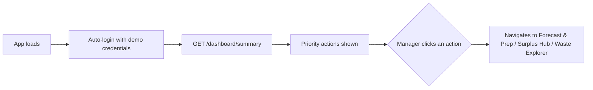
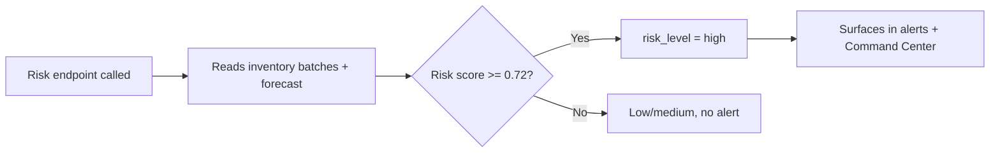
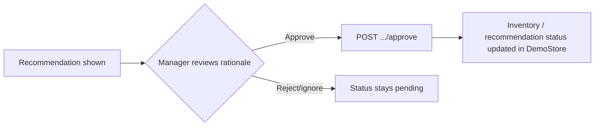
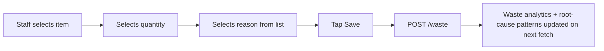
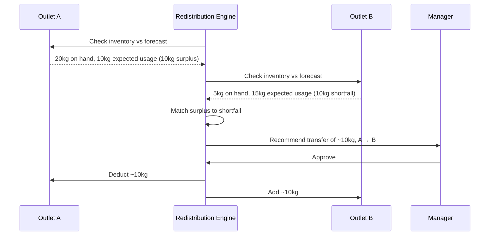

# User Workflows

Workflows 1–9 below are built and working end-to-end against the real backend (in-memory demo data, not mocked responses — see `docs/INTEGRATION_STATUS.md` for the exact list of what's wired vs. still using placeholder chart data on the frontend). Workflows 11–12 are planned and marked as such.

## 1. Manager Checks the Command Center
Manager opens the app (no separate login screen — it authenticates automatically with seeded demo credentials) → Command Center loads with today's prep quantity, high-risk batch count, cost saved this week, redistribution opportunity count, and a prioritized list of actions.

## 2. Inventory Becomes High-Risk
The risk engine re-evaluates every batch each time a risk-related endpoint is called (there's no separate background job today — it runs inline, per request, against the current demo data). A batch crossing into High risk shows up on the next `GET /alerts` or `GET /risk` call.

## 3. Spoilage Risk Is Flagged Early
Same mechanism as above — the risk score computation itself is the "detection." The system doesn't wait for a batch to actually expire; it flags it while there's still time to act, based on quantity vs. predicted consumption and days remaining.

## 4. System Recommends Action
Once a batch scores high risk, the procurement and redistribution logic separately check whether reducing further orders or moving stock from another outlet would help, and generate whichever recommendation applies. Preparation always prioritizes near-expiry batches first, since inventory listings are FEFO-ordered (soonest expiry first).

## 5. Manager Approves Action
Every recommendation that would change inventory or a recommendation's status requires an explicit `POST .../approve` call from a `manager` or `admin` role — enforced by the backend, not just hidden in the UI.

## 6. Inter-Outlet Redistribution
See the full scenario below — this is the flagship feature and the one most worth watching end-to-end.

## 7. Procurement Recommendation
Procurement lead opens the recommendation view → sees recommended buy/delay/reduce actions per ingredient with rationale → approves individually → recommendation status updates.

## 8. Preparation Recommendation
Kitchen manager opens Forecast & Prep → sees recommended prep quantity per ingredient with the rationale (predicted demand × buffer factor) → there's no override/edit flow in the current build; the recommendation is display-only today.

## 9. Waste Is Recorded
Kitchen staff logs a waste event via the mobile-first Waste Log screen — item, quantity, reason, stage — with a `POST /waste` call.

## 10. Root-Cause Pattern Review
Waste analytics group logged waste by ingredient and reason → when a group crosses a small quantity threshold, it shows up as a pattern with a plain-language line built from the real numbers, surfaced as an "insight" on the Command Center. The phrasing today comes from a template, not an LLM — see `07_AI_ML_DESIGN.md`.

## 11. Supplier/Batch Pattern Detection — **Planned, not built**
The idea: when incidents or spoilage tied to the same supplier/batch appear across more than one outlet within a time window, raise a review flag — never accusing the supplier, just surfacing a pattern for a human to check. Nothing in the current codebase implements this — no supplier-incident data exists yet.

## 12. Continuous Learning — **Planned, not built**
The idea: at the end of each forecast period, compare predicted vs. actual demand/waste and log the delta, so the system (and the user) can see whether its recommendations are actually improving outcomes over time — "Model missed by 18% last Saturday." Today, forecasts are computed on the fly and never persisted, so there's nothing to compare against later; this depends on the database/persistence work landing first.

---

## Complete Real-World Scenario: Inter-Outlet Tomato Redistribution
*(This exact scenario — 20 kg vs. 10 kg predicted usage at Outlet A, 5 kg vs. 15 kg at Outlet B — is covered almost verbatim by a unit test in `backend/tests/test_engines.py`, so it's a safe one to demo live.)*

**Setup**: A restaurant chain has three outlets — Outlet A, Outlet B, and Outlet C — all under the same organization in FoodWise AI.

- **Outlet A**: has 20 kg of tomatoes in inventory. Based on this week's forecast, expected usage before the next delivery is only 10 kg. The system computes a 10 kg surplus.
- **Outlet B**: has 5 kg of tomatoes. Based on its forecast, expected usage is 15 kg. The system computes a 10 kg shortfall.
- **Outlet C**: inventory and forecast are balanced — no action needed.

The redistribution engine scans all ingredients across outlets in the organization and finds the tomato imbalance between A and B. It generates a redistribution recommendation:

> "Transfer approximately 10 kg of tomatoes from Outlet A to Outlet B."

This recommendation appears on the Surplus Hub. The manager reviews it, confirms Outlet B genuinely needs more tomatoes this week, and approves the transfer.

`POST /redistribution/{id}/approve` is called. The system:
1. Deducts ~10 kg tomatoes from Outlet A's inventory in the demo store
2. Adds ~10 kg tomatoes to Outlet B's inventory in the demo store
3. Marks the redistribution opportunity as `approved`

**Result**: Outlet A avoids letting 10 kg of tomatoes go to waste. Outlet B avoids an unnecessary purchase and a potential understock situation. This is the flow to lead with in a demo — it's fully wired, and it's the one feature that most clearly differentiates the product from a plain forecasting or waste-logging tool.

