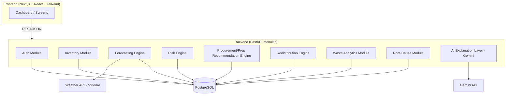
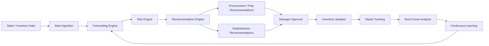
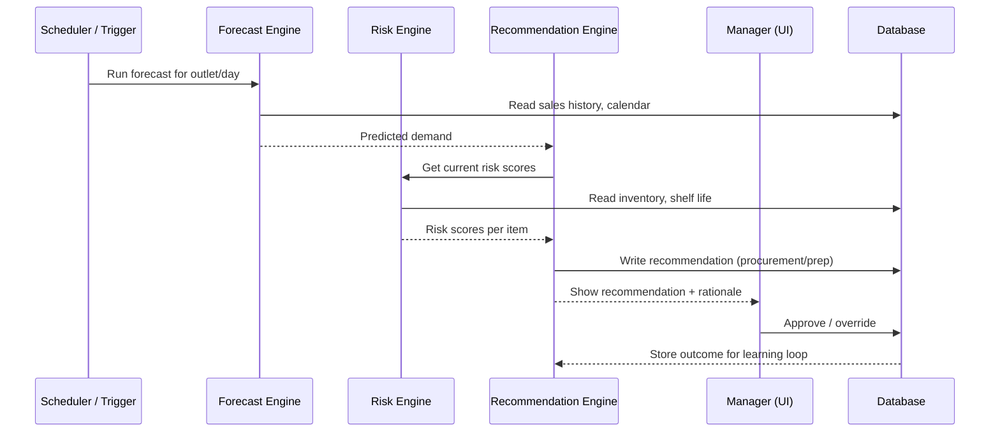
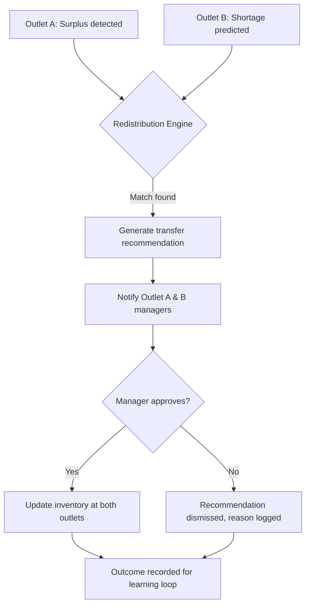

# System Architecture

## High-Level Architecture
NourishOS is built as a **modular FastAPI monolith** — one deployable backend service with clearly separated internal modules (domains), talking to a single PostgreSQL database. We deliberately avoided microservices; for a student-built prototype, a monolith with clean module boundaries is faster to build, easier to debug, and just as demoable.

## Frontend
- **Next.js + React + TypeScript + Tailwind CSS**
- Screens: dashboard/command center, inventory, forecast, risk, procurement, redistribution, waste analytics, supplier intelligence, root cause, recommendation center
- Charts via **Recharts**
- Talks to backend only via REST API — no direct DB access from frontend

## Backend
- **FastAPI (Python)**, organized as internal modules rather than separate services:
  - `auth` — login, JWT issuance, RBAC
  - `inventory` — ingredients, batches, stock levels, FEFO logic
  - `forecasting` — demand prediction per item/outlet
  - `risk` — spoilage risk scoring, safety/quality flags
  - `procurement` — buy/delay/reduce recommendations
  - `preparation` — prep quantity recommendations
  - `redistribution` — cross-outlet surplus/shortage matching
  - `waste` — waste event logging and analytics
  - `root_cause` — pattern + explanation generation
  - `ai_explain` — wraps Gemini API calls, always passed real backend data as context

## Database
- **PostgreSQL** with **SQLAlchemy** ORM
- Schema designed with `organization_id` / `outlet_id` on relevant tables so it's ready for multi-tenancy later, even though the prototype uses one organization
- See `05_DATABASE_DESIGN.md` for full schema

## AI Layer
- **Forecasting engine**: practical statistical approach (day-of-week + trend + seasonality adjustment on historical sales) — not a claimed trained deep model
- **Risk engine**: weighted rule-based scoring using shelf life remaining, quantity, predicted consumption, and historical usage
- **Optimization/recommendation engine**: rule-based logic for procurement, preparation, and redistribution matching
- **AI explanation layer**: Gemini API used only to turn structured backend results into a plain-language explanation — it never generates the underlying numbers itself

## External APIs
- **Gemini API** — natural-language explanations ("why is this recommended")
- **Weather API** (optional) — additional signal for demand forecasting if time allows

## Authentication
- JWT-based auth issued on login
- Role-based access control: `admin`, `manager`, `staff`
- Disruptive actions (approving procurement, approving redistribution) require a role with approval permission — enforcing the human-approval principle at the API layer, not just the UI

## Data Flow

## Recommendation Workflow

## Multi-Outlet Redistribution Workflow

## Notes on Realism for a Student Prototype
- Single backend deploy, single database — no message queues or container orchestration required for the demo
- Background jobs (forecast/risk recompute) can run as scheduled FastAPI background tasks or a simple cron-triggered script for the prototype; a real task queue (Celery/RQ) is a future upgrade, not a demo requirement
- All diagrams above reflect what will actually be built for SIH, not an idealized production system
