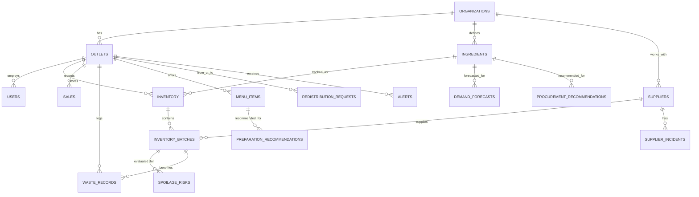

# Database Design

Database: **PostgreSQL**, accessed via **SQLAlchemy** (async, with `asyncpg`).

Design principle: keep the prototype schema lean, but include `organization_id`/`outlet_id` foreign keys from day one so the schema doesn't need a rewrite when we move to multi-tenant later.

## Entities

### users
| Field | Type | Notes |
|---|---|---|
| id | UUID (PK) | |
| organization_id | UUID (FK → organizations.id) | |
| name | varchar | |
| email | varchar, unique | |
| password_hash | varchar | |
| role | enum(admin, manager, staff) | |
| outlet_id | UUID (FK → outlets.id, nullable) | null for org-level (chain) roles |
| created_at | timestamp | |

### organizations
| Field | Type | Notes |
|---|---|---|
| id | UUID (PK) | |
| name | varchar | |
| created_at | timestamp | |

### outlets
| Field | Type | Notes |
|---|---|---|
| id | UUID (PK) | |
| organization_id | UUID (FK) | |
| name | varchar | |
| city | varchar | |
| address | varchar | |
| created_at | timestamp | |

### ingredients
| Field | Type | Notes |
|---|---|---|
| id | UUID (PK) | |
| organization_id | UUID (FK) | |
| name | varchar | |
| category | varchar | e.g. produce, dairy, grain |
| unit | varchar | kg, g, l, unit |
| default_shelf_life_days | int | |
| cost_per_unit | numeric | |

### inventory
| Field | Type | Notes |
|---|---|---|
| id | UUID (PK) | |
| outlet_id | UUID (FK) | |
| ingredient_id | UUID (FK) | |
| current_quantity | numeric | denormalized total across batches, kept in sync |
| unit | varchar | |
| updated_at | timestamp | |

### inventory_batches
| Field | Type | Notes |
|---|---|---|
| id | UUID (PK) | |
| inventory_id | UUID (FK) | |
| batch_code | varchar | |
| quantity | numeric | |
| purchase_date | date | |
| expiry_date | date | indexed — used heavily by risk engine |
| supplier_id | UUID (FK → suppliers.id) | |
| storage_condition | varchar (nullable) | |

### suppliers
| Field | Type | Notes |
|---|---|---|
| id | UUID (PK) | |
| organization_id | UUID (FK) | |
| name | varchar | |
| contact_info | varchar | |

### supplier_incidents
| Field | Type | Notes |
|---|---|---|
| id | UUID (PK) | |
| supplier_id | UUID (FK) | |
| batch_id | UUID (FK → inventory_batches.id, nullable) | |
| outlet_id | UUID (FK) | |
| incident_type | varchar | e.g. quality, spoilage, delay |
| description | text | |
| reported_at | timestamp | |

### sales
| Field | Type | Notes |
|---|---|---|
| id | UUID (PK) | |
| outlet_id | UUID (FK) | |
| ingredient_id | UUID (FK, nullable) | for menu-item-level sales, link via menu_items instead |
| menu_item_id | UUID (FK → menu_items.id, nullable) | |
| quantity_sold | numeric | |
| sale_date | date | indexed |
| channel | varchar | dine-in, takeaway, etc. |

### demand_forecasts
| Field | Type | Notes |
|---|---|---|
| id | UUID (PK) | |
| outlet_id | UUID (FK) | |
| ingredient_id | UUID (FK) | |
| forecast_date | date | |
| predicted_quantity | numeric | |
| lower_bound | numeric | |
| upper_bound | numeric | |
| model_version | varchar | |
| created_at | timestamp | |

### spoilage_risks
| Field | Type | Notes |
|---|---|---|
| id | UUID (PK) | |
| inventory_batch_id | UUID (FK) | |
| risk_level | enum(low, medium, high) | |
| risk_score | numeric | 0–1 or 0–100 |
| computed_at | timestamp | |
| rationale | text | human-readable explanation |

### waste_records
| Field | Type | Notes |
|---|---|---|
| id | UUID (PK) | |
| outlet_id | UUID (FK) | |
| ingredient_id | UUID (FK) | |
| inventory_batch_id | UUID (FK, nullable) | |
| quantity | numeric | |
| reason | varchar | overproduction, spoilage, quality issue, etc. |
| stage | varchar | prep, storage, service |
| logged_by | UUID (FK → users.id) | |
| logged_at | timestamp | indexed |

### redistribution_requests
| Field | Type | Notes |
|---|---|---|
| id | UUID (PK) | |
| ingredient_id | UUID (FK) | |
| from_outlet_id | UUID (FK → outlets.id) | |
| to_outlet_id | UUID (FK → outlets.id) | |
| suggested_quantity | numeric | |
| status | enum(pending, approved, rejected, completed) | |
| rationale | text | |
| created_at | timestamp | |
| resolved_at | timestamp (nullable) | |

### procurement_recommendations
| Field | Type | Notes |
|---|---|---|
| id | UUID (PK) | |
| outlet_id | UUID (FK) | |
| ingredient_id | UUID (FK) | |
| recommended_action | enum(buy, delay, reduce) | |
| recommended_quantity | numeric | |
| rationale | text | |
| status | enum(pending, approved, rejected) | |
| created_at | timestamp | |

### preparation_recommendations
| Field | Type | Notes |
|---|---|---|
| id | UUID (PK) | |
| outlet_id | UUID (FK) | |
| menu_item_id | UUID (FK) | |
| service_date | date | |
| predicted_demand | numeric | |
| recommended_prep_quantity | numeric | includes buffer |
| rationale | text | |

### alerts
| Field | Type | Notes |
|---|---|---|
| id | UUID (PK) | |
| outlet_id | UUID (FK) | |
| type | varchar | risk, overstock, understock, near_expiry, redistribution, procurement, pattern |
| severity | enum(low, medium, high) | |
| message | text | |
| related_entity_type | varchar | e.g. inventory_batch, redistribution_request |
| related_entity_id | UUID | |
| created_at | timestamp | |
| acknowledged | boolean | default false |

### menu_items *(supporting entity, referenced above)*
| Field | Type | Notes |
|---|---|---|
| id | UUID (PK) | |
| outlet_id | UUID (FK) | |
| name | varchar | |

## Relationships Summary
- `organizations` → `outlets` (1:many)
- `outlets` → `users`, `inventory`, `sales`, `waste_records`, `menu_items` (1:many)
- `ingredients` → `inventory`, `inventory_batches`, `demand_forecasts` (1:many)
- `inventory` → `inventory_batches` (1:many, FEFO ordering by `expiry_date`)
- `suppliers` → `inventory_batches`, `supplier_incidents` (1:many)
- `redistribution_requests` references two outlets (`from_outlet_id`, `to_outlet_id`)

## Indexing Notes
- `inventory_batches.expiry_date` — indexed, used constantly by the risk engine for FEFO and near-expiry queries
- `sales.sale_date`, `waste_records.logged_at` — indexed for trend queries
- `redistribution_requests.status`, `procurement_recommendations.status` — indexed for dashboard filtering

## ER Diagram

