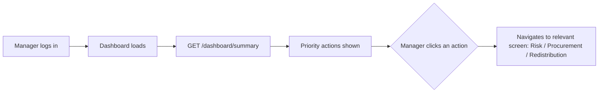
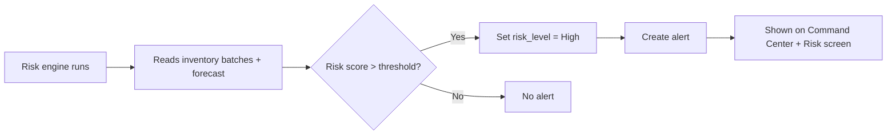
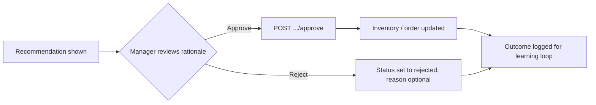
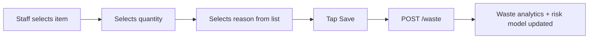
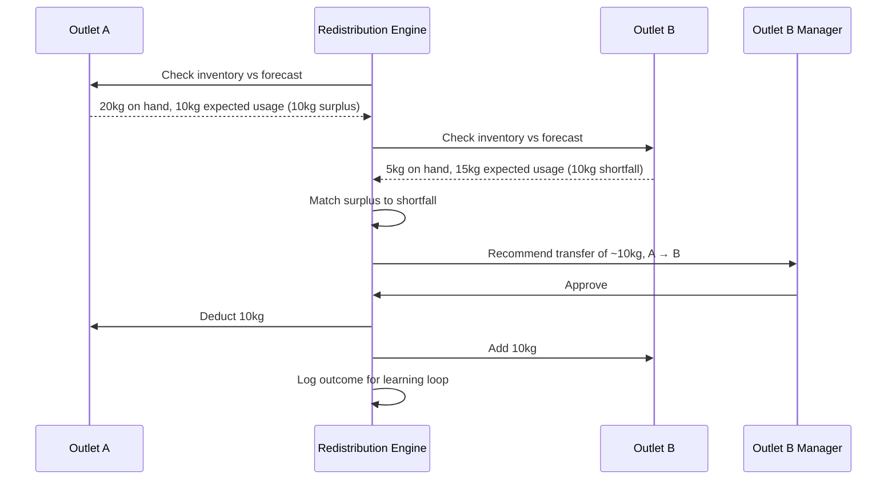

# User Workflows

## 1. Restaurant Manager Checks Dashboard
Manager logs in → sees Command Center with today's prep quantity, current waste risk %, cost saved this week, and a prioritized list of actions. This is the daily entry point.

## 2. Inventory Becomes High-Risk
Background risk job re-evaluates all active batches (or triggered on new inventory data) → a batch crosses into High risk → alert generated.

## 3. AI Detects Likely Spoilage
Same as above — the risk score computation itself is the "detection." The system doesn't wait for the batch to actually expire; it flags it while there's still time to act (e.g., 1–2 days before expiry, based on quantity vs predicted consumption).

## 4. System Recommends Action
Once a batch is flagged High risk, the recommendation engine checks: can this be prevented by (a) reducing further procurement, (b) redistributing to another outlet, or (c) prioritizing it in prep (FEFO)? It generates whichever recommendation applies.

## 5. Manager Approves Action
Every recommendation that would change inventory or trigger a purchase requires explicit manager approval — the system never acts unilaterally on disruptive actions.

## 6. Inter-Outlet Redistribution
See the full scenario below — this is one of the strongest features and gets its own detailed walkthrough.

## 7. Procurement Recommendation
Weekly (or on-demand), procurement lead opens Procurement screen → sees recommended buy/delay/reduce actions per ingredient → approves in bulk or individually → recommendation status updates, and the numbers feed into next week's baseline.

## 8. Preparation Recommendation
Each morning (or per shift), kitchen manager opens Forecast & Prep screen → sees recommended prep quantity per menu item with the rationale ("predicted demand 400, +5% buffer = 420") → can override manually if they have local knowledge the system doesn't (e.g., a private event) → recommendation and override are both logged.

## 9. Waste Is Recorded
Kitchen staff logs a waste event during or after service — item, quantity, reason, stage — in under 10 seconds (tap-first UI, no typing required for common cases).

## 10. Root-Cause Analysis
Waste analytics aggregate over time → when a repeated pattern crosses a threshold (e.g., same ingredient wasted on the same day-of-week for 3+ weeks), the root-cause module generates a plain-language explanation, shown on the Waste Analytics / Root Cause screen.

## 11. Supplier/Batch Pattern Detection
When supplier incidents or spoilage events tied to the same supplier/batch appear across more than one outlet within a time window, an alert is raised: "Potential recurring supplier/batch issue detected. Review recommended." This never accuses the supplier — it flags a pattern for a human to investigate.

## 12. Continuous Learning
At the end of each forecast period, the system compares predicted vs actual demand and predicted vs actual waste, and logs the delta. This is shown to the user ("Model missed by 18% last Saturday") and used to sanity-check whether recommendations are actually improving outcomes over time.

---

## Complete Real-World Scenario: Inter-Outlet Tomato Redistribution

**Setup**: A restaurant chain has three outlets — Outlet A, Outlet B, and Outlet C — all under the same organization in NourishOS.

**Monday, 9:00 AM** — The nightly risk/forecast job runs across all outlets.

- **Outlet A**: has 20 kg of tomatoes in inventory. Based on this week's forecast, expected usage before the next delivery is only 10 kg. The system computes a 10 kg surplus.
- **Outlet B**: has 5 kg of tomatoes. Based on its forecast (higher-traffic outlet this week due to a nearby event), expected usage is 15 kg. The system computes a 10 kg shortfall.
- **Outlet C**: inventory and forecast are balanced — no action needed.

**9:05 AM** — The redistribution engine scans all ingredients across outlets in the organization and finds the tomato imbalance between A and B. It generates a redistribution recommendation:

> "Transfer approximately 10 kg of tomatoes from Outlet A to Outlet B. Outlet A has 20 kg with expected usage of 10 kg. Outlet B has 5 kg with expected usage of 15 kg."

**9:10 AM** — This recommendation appears on the Command Center for both outlet managers, and on the chain-level Redistribution screen for the operations head. It also suppresses/reduces the procurement recommendation that would otherwise have suggested Outlet B buy more tomatoes — the system checks redistribution opportunities before recommending a fresh purchase.

**9:30 AM** — Outlet B's manager reviews the recommendation, confirms Outlet B genuinely needs more tomatoes this week, and approves the transfer.

**9:31 AM** — `POST /redistribution/{id}/approve` is called. The system:
1. Updates Outlet A's inventory (−10 kg tomatoes)
2. Updates Outlet B's inventory (+10 kg tomatoes, once physically transferred/confirmed)
3. Marks the redistribution request as `approved` (and later `completed` once transfer is confirmed)
4. Cancels or reduces the procurement recommendation that was pending for Outlet B

**Result**: Outlet A avoids letting 10 kg of tomatoes go to waste. Outlet B avoids an unnecessary purchase and a potential understock situation. The organization's total waste and total spend both improve, and this outcome is logged — if this pattern (A having surplus when B has a shortfall) repeats, the system will surface it faster next time.

